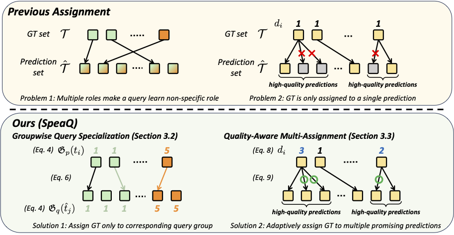

[//]: # (# Groupwise Query Specialization and Quality-Aware Multi-Assignment for Transformer-based Visual Relationship Detection)
# Official Implementation of SpeaQ (CVPR 2024)

Official PyTorch implementation of "[Groupwise Query Specialization and Quality-Aware Multi-Assignment for Transformer-based Visual Relationship Detection](https://arxiv.org/abs/2403.17709)" (CVPR 2024).
> Jongha Kim*, Jihwan Park*, Jinyoung Park*, Jinyoung Kim, Sehyung Kim, Hyunwoo J. Kim.
> 
> Department of Computer Science and Engineering, Korea University 

<div align="center">
  
</div>

## Setup
### Creating conda environment and installing python packages
```
conda create -n SpeaQ python=3.9
conda activate SpeaQ

pip install h5py imantics easydict opencv-python scikit-learn scipy pandas setuptools==59.5.0 wandb numpy==1.21.6 pillow==9.5.0
```
### Installing PyTorch and Detectron2
- This code is tested on PyTorch 1.10.0, CUDA 11.1 and Detectron2 0.5.1.
- Note that different PyTorch, CUDA, or detectron2 versions may be required depending on your system. 
Please refer to official installation instructions of [PyTorch](https://pytorch.org/get-started/previous-versions/) and [Detectron2](https://detectron2.readthedocs.io/en/latest/tutorials/install.html) to install different versions.
```
pip install torch==1.10.0+cu111 torchvision==0.11.0+cu111 torchaudio==0.10.0 -f https://download.pytorch.org/whl/torch_stable.html

python -m pip install detectron2 -f \
  https://dl.fbaipublicfiles.com/detectron2/wheels/cu111/torch1.10/index.html
```


## Dataset and Pre-trained Weights Preparation
For this section, we follow instructions from the [Iterative Scene Graph Generation](https://github.com/ubc-vision/IterativeSG).
Please refer to the original repository for more details.

### Preparing Dataset
We use the Visual Genome filtered data widely used in the Scene Graph community. 
Please refer to [Unbiased Scene Graph Generation repository](https://github.com/KaihuaTang/Scene-Graph-Benchmark.pytorch/blob/master/DATASET.md) for instructions to download this dataset. 
After downloading the dataset you should have the following 4 files: 
- `VG_100K `directory containing all the images
- `VG-SGG-with-attri.h5` 
- `VG-SGG-dicts-with-attri.json` (Can be found in the same repository [here](https://github.com/KaihuaTang/Scene-Graph-Benchmark.pytorch/tree/master/datasets/vg))
- `image_data.json` (Can be found in the same repository [here](https://github.com/KaihuaTang/Scene-Graph-Benchmark.pytorch/tree/master/datasets/vg))

### Preparing Pre-trained DETR Weights
To enable faster model convergence, we use weights of DETR pre-trained on VG dataset.
We replicate the DETR decoder weights three times, and initialize decoder weights of the baseline model with replicated weights. 
For convenience, the pretrained weights (with the decoder replication) are made available [here](https://drive.google.com/drive/folders/1CdcYdcYEvkZHz-I1IFF8sBxVMWSyWIkh?usp=share_link). 
To use these weights during training, simply use the `MODEL.WEIGHTS <Path to downloaded checkpoint>` flag in the training command.


## Training
We provide two training scripts: one for the baseline model and the other for the model trained with SpeaQ.

The **baseline model** can be trained using the following command:
```
python train_iterative_model.py --resume --num-gpus <NUM_GPUS> \
--config-file configs/speaq.yaml --dist-url <PORT_NUM> OUTPUT_DIR <PATH TO CHECKPOINT DIR> \ 
DATASETS.VISUAL_GENOME.IMAGES <PATH TO VG_100K IMAGES> \
DATASETS.VISUAL_GENOME.MAPPING_DICTIONARY <PATH TO VG-SGG-dicts-with-attri.json> \
DATASETS.VISUAL_GENOME.IMAGE_DATA <PATH TO image_data.json> \
DATASETS.VISUAL_GENOME.VG_ATTRIBUTE_H5 <PATH TO VG-SGG-with-attri.h5> \
MODEL.DETR.OVERSAMPLE_PARAM 0.07 MODEL.DETR.UNDERSAMPLE_PARAM 1.5 \
SOLVER.IMS_PER_BATCH 20 MODEL.WEIGHTS <PATH TO vg_objectdetector_pretrained.pth>
```

The **model with SpeaQ** can be trained using the following command:
```
python train_iterative_model.py --resume --num-gpus <NUM_GPUS> \
--config-file configs/speaq.yaml --dist-url <PORT_NUM> OUTPUT_DIR <PATH TO CHECKPOINT DIR> \ 
DATASETS.VISUAL_GENOME.IMAGES <PATH TO VG_100K IMAGES> \
DATASETS.VISUAL_GENOME.MAPPING_DICTIONARY <PATH TO VG-SGG-dicts-with-attri.json> \
DATASETS.VISUAL_GENOME.IMAGE_DATA <PATH TO image_data.json> \
DATASETS.VISUAL_GENOME.VG_ATTRIBUTE_H5 <PATH TO VG-SGG-with-attri.h5> \
MODEL.DETR.OVERSAMPLE_PARAM 0.07 MODEL.DETR.UNDERSAMPLE_PARAM 1.5 \
SOLVER.IMS_PER_BATCH 20  MODEL.WEIGHTS <PATH TO vg_objectdetector_pretrained.pth> \
MODEL.DETR.ONE2MANY_SCHEME dynamic MODEL.DETR.MULTIPLY_QUERY 2 \
MODEL.DETR.ONLY_PREDICATE_MULTIPLY True MODEL.DETR.ONE2MANY_K 4 \
MODEL.DETR.ONE2MANY_DYNAMIC_SCHEME max MODEL.DETR.USE_GROUP_MASK True \
MODEL.DETR.MATCH_INDEPENDENT True \
MODEL.DETR.NUM_GROUPS 4 MODEL.DETR.ONE2MANY_PREDICATE_SCORE True \
MODEL.DETR.ONE2MANY_PREDICATE_WEIGHT -0.5
```

Note that [Iterative Scene Graph Generation](https://github.com/ubc-vision/IterativeSG) applies loss re-weighting scheme to relieve long-tail problem.
Such option can be turned off by setting ```MODEL.DETR.OVERSAMPLE_PARAM 0.0 MODEL.DETR.UNDERSAMPLE_PARAM 0.0```.


## Evaluation
To evaluate the model trained with SpeaQ, some modifications should be made to the training command:
1. Change the ```--config-file``` options from ```configs/speaq.yaml``` to ```configs/speaq_test.yaml```.
2. Set ```OUTPUT_DIR``` to the directory containing the trained model checkpoint.
3. Add ```--eval-only``` flag to the command.

For convenience, we provide the checkpoint of the model trained with SpeaQ [here](https://drive.google.com/file/d/10H2-8Eb4QOJCnwaNujisjkxiSxuKySih/view?usp=drive_link).
After unzipping the provided file (```speaq_checkpoints.zip```), the model can be evaluated using the following command:
```
python train_iterative_model.py --resume --eval-only --num-gpus 4 --config-file configs/speaq_test.yaml \ 
--dist-url <PORT_NUM> OUTPUT_DIR <PATH TO speaq_checkpoints> \
DATASETS.VISUAL_GENOME.IMAGES <PATH TO VG_100K IMAGES> \
DATASETS.VISUAL_GENOME.MAPPING_DICTIONARY <PATH TO VG-SGG-dicts-with-attri.json> \
DATASETS.VISUAL_GENOME.IMAGE_DATA <PATH TO image_data.json> \
DATASETS.VISUAL_GENOME.VG_ATTRIBUTE_H5 <PATH TO VG-SGG-with-attri.h5> \
MODEL.DETR.OVERSAMPLE_PARAM 0.07 MODEL.DETR.UNDERSAMPLE_PARAM 1.5 \
SOLVER.IMS_PER_BATCH 20  MODEL.DETR.ONE2MANY_SCHEME dynamic MODEL.DETR.MULTIPLY_QUERY 2 \
MODEL.DETR.ONLY_PREDICATE_MULTIPLY True MODEL.DETR.ONE2MANY_K 4 \
MODEL.DETR.ONE2MANY_DYNAMIC_SCHEME max MODEL.DETR.USE_GROUP_MASK True \
MODEL.DETR.MATCH_INDEPENDENT True \
MODEL.DETR.NUM_GROUPS 4 MODEL.DETR.ONE2MANY_PREDICATE_SCORE True \
MODEL.DETR.ONE2MANY_PREDICATE_WEIGHT -0.5
```

With the provided checkpoint, you should get results similar to the following on ```VG_test``` split if setup correctly:
```python
SGG eval:     R @ 20: 0.2508;     R @ 50: 0.3206;     R @ 100: 0.3554;  for mode=sgdet, type=Recall(Main).
SGG eval:  ng-R @ 20: 0.2362;  ng-R @ 50: 0.3078;  ng-R @ 100: 0.3482;  for mode=sgdet, type=No Graph Constraint Recall(Main).
SGG eval:    zR @ 20: 0.0123;    zR @ 50: 0.0304;    zR @ 100: 0.0463;  for mode=sgdet, type=Zero Shot Recall.
SGG eval:    mR @ 20: 0.1011;    mR @ 50: 0.1508;    mR @ 100: 0.1760;  for mode=sgdet, type=Mean Recall.
```

## Citations
```
@inproceedings{kim2024groupwise,
      title={Groupwise Query Specialization and Quality-Aware Multi-Assignment for Transformer-based Visual Relationship Detection}, 
      author={Kim, Jongha and Park, Jihwan and Park, Jinyoung and Kim, Jinyoung and Kim, Sehyung and Kim, Hyunwoo J},
      booktitle={CVPR},
      year={2024},
}
```

## Acknowledgements
This repository is built upon [Iterative Scene Graph Generation](https://github.com/ubc-vision/IterativeSG).
